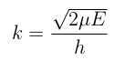
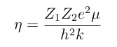
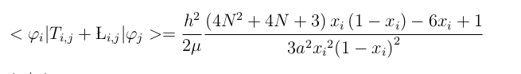
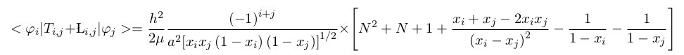
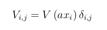
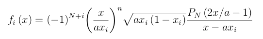
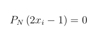
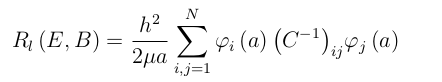
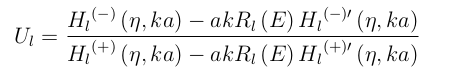
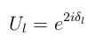

# Q.M-Nuclear Physics: Collision Phase shifts of two nuclei using the R-matrix Theory

## The stationary Schrödinger equation

If the Coulomb and Nuclear potential are considered, the radial stationary Schrödinger equation can be written as

In order to find the solutions of the equation above, it is useful to divide the configuration space into two regions: i) The internal region with r<a, where the nuclear and Coulomb potential interaction dominate; ii) The external region with r>a where the Nuclear potential vanishes. 

The solution for the external region can be written in terms of the Hankel functions 

which are constructed by Coulomb functions and the cosine and sine of a phase shift.

Here:

Z1 and Z2 are the atomic number of projectile and target respectively

The phase shift can be obtained using the method of R-matrix.

## R-Matrix 

Firstly C matrix is created as

where the kinetic elements are calculated using the Gauss-Legendre quadrature plus a Blonch operator Li,j

For i=j

For i≠j

The potential matrix elements take the simple form

φi are the Lagrange-Legendre functions evaluated in a (fi(a)), these fucntions are defined as

Here xi are the roots of Legendre polynomial of order N  (PN), which satisfies  

Then, the R-matrix is made following the equation below

## Scattering matrix

Once we know the R-matrix, it is possible to find the scaterring matrix appearing in the asymptotic scattering wave function.

Then, the phase shift is easy to find due to the fact that

## Python Program

I constructed a program in python that calculates the shift phase in function of the energy (MeV) (MatrixPhaseShiftsInDegrees.py), for the 12C and a proton. The potential which is used in this program is:

VN(r)=-73.8exp(-(r/2.70)

y2

