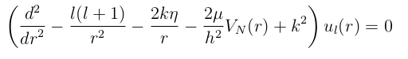
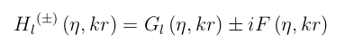
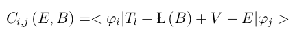

# Q.M-Nuclear-Physics-Phase-shifts-from-R-matrix-theory

## The stationary Schrödinger equation

If the Coulomb and Nuclear potential are considered, the radial stationary Schrödinger equation can be written as

In order to find the solutions of the equation above, it is useful to divide the configuration space into two regions: i) The internal region with r<a, where the nuclear and Coulomb potential interaction dominate; ii) The external region with r>a where the Nuclear potential vanishes. 

The solution for the external region can be written in terms of the Hankel functions 

which are constructed by Coulomb functions and the cosine and sine of a phase shift.

The phase shift can be obtained using the method of R-matrix.

C matrix is defined as

where the kinetic elements are calculated using the Gauss-Legendre quadrature plus a Blonch operator Li,j

